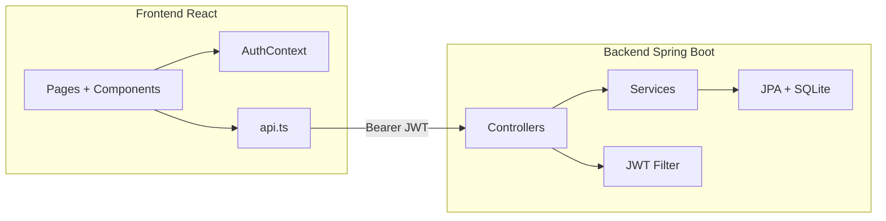
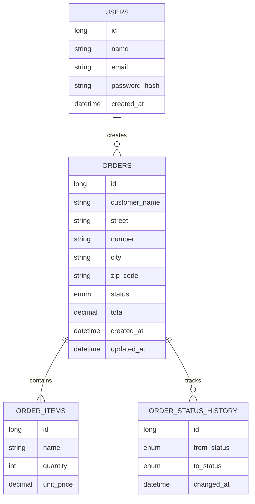
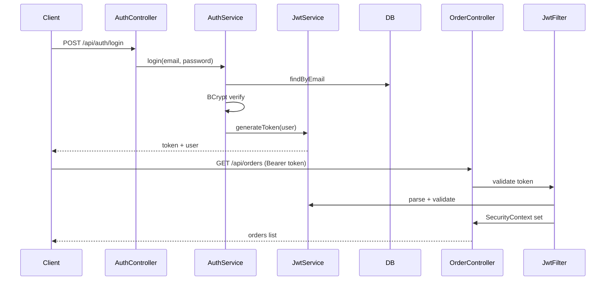

# Foody — Plano de Arquitetura

## 1. Visão geral

Monorepo com back-end Spring Boot e front-end React, comunicando via REST + JWT.



## 2. Stack

| Camada | Tecnologia | Justificativa |
|--------|------------|---------------|
| Back-end | Spring Boot 3.5.16 | Ecossistema maduro, REST + Security + JPA |
| Runtime | Java 21 (Temurin) | LTS, compatível com Spring Boot 3.x |
| Build | Maven Wrapper | Sem dependência de Maven global |
| Banco | SQLite + Hibernate community dialect | Persistência local simples, zero config |
| Auth | Spring Security + JWT (jjwt) | Stateless, adequado para SPA |
| API docs | springdoc-openapi | Swagger UI automático |
| Front-end | React 19 + Vite + TS | SPA rápida com HMR |
| Estilo | Tailwind CSS v4 | UI responsiva com utilitários |

## 3. Modelo de dados



## 4. Fluxo de autenticação



## 5. Estrutura de pacotes (back-end)

```
com.foody.tracking
├── FoodyTrackingApplication
├── config/          SecurityConfig, OpenApiConfig, DataSeeder
├── auth/            AuthController, AuthService, DTOs
├── security/        JwtService, JwtAuthenticationFilter, AppUserDetailsService
├── user/            User, UserRepository
├── order/           entidades, repositórios, service, controller, DTOs
└── common/          exceções, GlobalExceptionHandler
```

## 6. Estrutura front-end

```
frontend/src/
├── lib/             api.ts, types.ts
├── context/         AuthContext.tsx
├── components/      ProtectedRoute, Layout, StatusBadge
└── pages/           Login, Register, Orders, NewOrder, OrderDetail
```

## 7. Configuração SQLite

- Arquivo: `backend/data/foody.db`
- Hikari `maximum-pool-size: 1` (lock de escrita único)
- `ddl-auto: update` para desenvolvimento
- Dialeto: `org.hibernate.community.dialect.SQLiteDialect`

## 8. Segurança

- Endpoints públicos: `/api/auth/register`, `/api/auth/login`, Swagger
- Demais `/api/**` exigem JWT
- CORS habilitado para `http://localhost:5173`
- Senhas hasheadas com BCrypt
